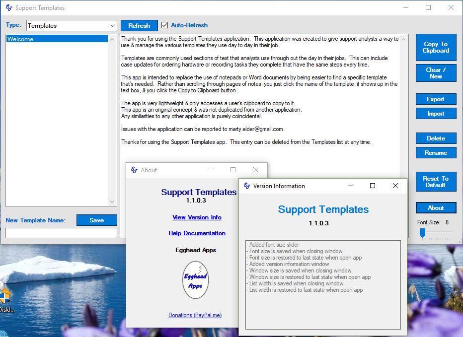

# SupportTemplates
Click the SupportTemplates.msi above to download the latest version!

Windows application to manage text templates.

Initially designed for support analysts, this application allows the user to save, recall, & delete common comment templates.  These are used in support centers when analysts are reusing the same text over and over.  Commonly they are saved in a Word document or a text document.  The user has to then scan through the document to find the needed template, has to highlight, copy, & then paste it into their case/ticket management system.

Support Templates takes the place of the document and provides a much easier method of finding and copying the needed template.  After the user's common templates are saved, he/she just clicks on the template name and the text is populated into the text box.  There is a 'Copy to Clipboard' button to have Windows read and save the text to the user's clipboard.  It can then be pasted into the other application(s).

You can check out the help doc at https://sites.google.com/site/martyelder/support-templates

Download the SupportTemplates.msi to give it a try!

